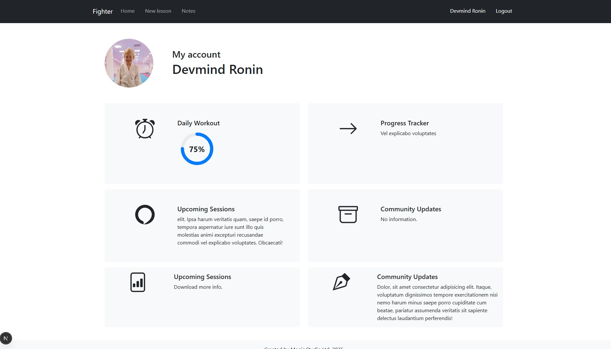

# Crafticos Admin

A simple admin interface for a hobby club. Users can log in using **credentials** or **Google authentication** to access basic member information. The UI features a minimal top navigation bar for quick access.

## 🛠️ Tech Stack

### Frontend
- Next.js 15
- React 19
- Apollo Client
- NextAuth (credentials & Google auth)
- Bootstrap + React Bootstrap

### Backend
- Express.js
- GraphQL (Apollo Server)
- PostgreSQL (via pg-promise)
- JSON Web Token (JWT)
- Bcrypt for password hashing

## 🚀 Getting Started

### Backend
```js
cd backend
npm install
npm run dev
```

### Frontend
```js
cd frontend
npm install
npm run dev
```

